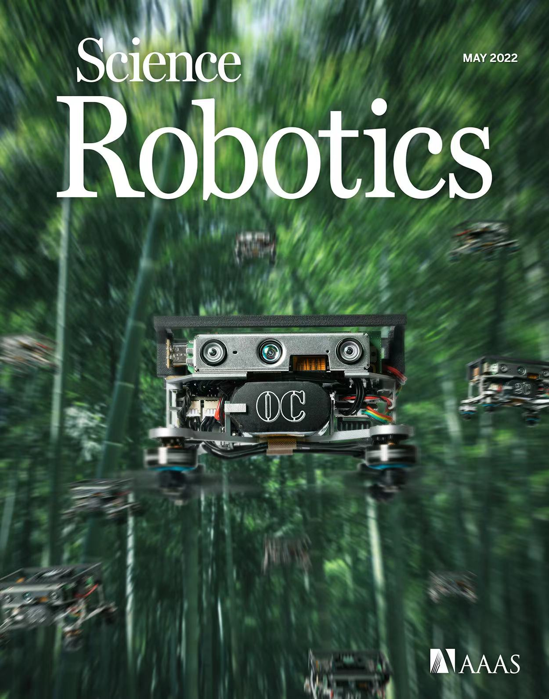

# EGO-Planner-v2
Swarm Playground, the codebase of the paper "[Swarm of micro flying robots in the wild](https://www.science.org/doi/10.1126/scirobotics.abm5954)".

# Installation-Free Usage

Please follow the [tutorial PDF file](swarm-playground/[README]_Brief_Documentation_for_Swarm_Playground.pdf) with corresponding videos ([1](swarm-playground/main_ws/WatchMe_main.mp4), [2](swarm-playground/formation_ws/WatchMe_formation.mp4), [3](swarm-playground/tracking_ws/WatchMe_tracking.mp4), [4](swarm-playground/interlaced_flight_ws/WatchMe_interlaced_flights.mp4)) to run the code.

This work was born out of [MINCO](https://github.com/ZJU-FAST-Lab/GCOPTER).
If you find it interesting, please give both repos stars generously. Thanks.

